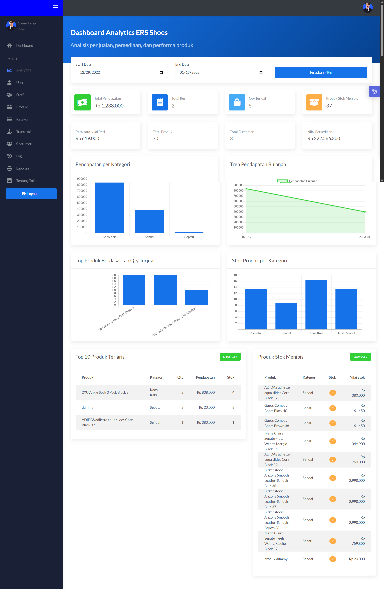

# Ers Shoes: Sales and Inventory Analytics Dashboard

## 1. Project Overview

**Ers Shoes: Sales and Inventory Analytics Dashboard** is a web-based information system developed for managing sales, products, customers, staff, receipts, inventory, and reporting activities at Ers Shoes. The original system was built as a database management project for a shoe store, where the main problem was that sales recording, income calculation, and stock monitoring were still inefficient when handled manually.

The project was later improved by adding an analytics dashboard to highlight its value as a **Data Analyst portfolio project**. Instead of only storing and displaying operational data, the system now uses transaction and inventory data from a MySQL database to generate key business metrics, charts, reports, and business insights.

The main purpose of this project is to help store owners and staff monitor sales performance, track inventory conditions, identify best-selling products, detect low-stock items, and support better restocking decisions based on data.

---

## 2. Dashboard Preview



The analytics dashboard above shows the sales and inventory performance of **Ers Shoes** in one view. This page was added to make the system more useful not only as a transaction recording application, but also as a simple business analytics tool. Through this dashboard, users can monitor total revenue, number of receipts, total quantity sold, average transaction value, low-stock products, total products, total customers, and inventory value.

The dashboard also includes several visualizations, such as revenue by product category, monthly revenue trend, top-selling products by quantity sold, and stock distribution by category. These charts help the store owner understand which product categories contribute most to revenue, how sales move over time, which products sell the most, and which categories still hold the most inventory.

In addition, the dashboard provides tables for **Top 10 Best-Selling Products** and **Low-Stock Products**. These tables are useful for identifying products that should be prioritized for restocking, promotion, or further sales monitoring. CSV export is also provided so the analyzed data can be reused in spreadsheet tools such as Excel, Google Sheets, or other BI tools.

---

## 3. Business Problem

Ers Shoes is a shoe store that needs a more efficient way to manage product data, stock, sales transactions, and income reports. Manual calculation of sales and stock can take time, increase the risk of errors, and make it difficult for the owner to understand business performance quickly.

This system was developed to answer several business needs:

- simplifying sales and receipt recording;
- helping the store monitor product stock;
- reducing manual income calculation;
- providing structured reports for sales and inventory;
- giving different access rights to admin and cashier users;
- helping the owner make decisions based on transaction and inventory data.

With the added analytics dashboard, the system is also able to summarize data into business metrics and visualizations, making it easier to see sales performance and inventory conditions.

---

## 4. Project Objectives

The objectives of this project are:

1. To build a web-based sales and inventory information system for Ers Shoes.
2. To manage product, category, customer, staff, user, receipt, and transaction data in a structured MySQL database.
3. To apply database management concepts such as views, triggers, stored functions, stored procedures, and table relationships.
4. To provide reporting features for sales, assets, and stock monitoring.
5. To add an analytics dashboard that presents key business metrics, charts, and exportable reports.
6. To support data-driven decision-making for sales monitoring and restocking.

---

## 5. Tools and Technologies

| Category | Tools / Technologies |
|---|---|
| Programming Language | PHP |
| Database | MySQL / MariaDB |
| Frontend | HTML, CSS, Bootstrap |
| Data Visualization | Chart.js |
| Local Server | XAMPP |
| Database Management | phpMyAdmin |
| Query Language | SQL |
| Reporting | HTML table, CSV export, printable reports |
| Version Control | GitHub |

---

## 6. User Roles and Access

The system has two main user roles: **Admin** and **Cashier**.

### Admin

Admin has broader access to manage and monitor the system. Admin can manage staff, users, product data, categories, transactions, receipts, asset reports, logs, and the analytics dashboard.

### Cashier

Cashier has more limited access. Cashier can view product data, create receipts, record transactions, and monitor transaction-related information.

This role separation helps ensure that each user only accesses the features relevant to their responsibility.

---

## 7. End-to-End Project Process

### 7.1 Requirement Analysis

The first stage was identifying the needs of Ers Shoes. The store needed a system to record sales, manage inventory, calculate income, monitor product stock, and organize operational data more efficiently.

### 7.2 Database Design

The database was designed using MySQL and named `db_sepatu`. It stores the main operational data of the store, including products, categories, customers, staff, users, receipts, and transactions. The database also includes log tables, views, triggers, stored functions, and stored procedures to support data integrity, reporting, and transaction monitoring.

### 7.3 Web Application Development

The application was developed using PHP and connected to the MySQL database. The system includes login, dashboard, user management, staff management, product management, category management, receipt management, transaction management, reports, and logs.

### 7.4 Database Automation

Triggers were created to automatically record changes in log tables, update stock when transactions occur, return stock when transactions are deleted, and prevent changes to important ID fields. Stored functions and procedures were used to calculate sales totals, asset values, receipt totals, and generate report data.

### 7.5 Analytics Dashboard Development

An additional analytics page was developed to turn transaction and inventory data into business insights. The dashboard uses SQL queries to calculate metrics such as total revenue, total receipts, quantity sold, average transaction value, low-stock products, top-selling products, revenue by category, monthly revenue trend, and inventory value.

### 7.6 Reporting and Export

The system provides sales and inventory reports, printable report pages, and CSV export from the analytics dashboard. This allows analyzed data to be reused outside the application when needed.

---

## 8. Database Overview

The database used in this project is:

```sql
db_sepatu
```

The database contains main tables, log tables, views, triggers, stored functions, and stored procedures. These database objects are used not only to store data, but also to maintain data consistency, support reporting, and automate several business processes.

---

## 9. Main Tables

| Table | Description |
|---|---|
| `costumer` | Stores customer data used in receipt and transaction records. |
| `kategori` | Stores product category data. |
| `produk` | Stores product data, including product name, category, price, and stock quantity. |
| `resi` | Stores receipt data, including customer, cashier, transaction time, and payment information. |
| `staff` | Stores staff data. |
| `toko` | Stores store information. |
| `transaksi` | Stores transaction details, including receipt number, product, quantity, and transaction time. |
| `user` | Stores user login data and role information. |

---

## 10. Log Tables

| Log Table | Description |
|---|---|
| `log_produk` | Records product insert, update, and delete activities. |
| `log_resi` | Records receipt insert, update, and delete activities. |
| `log_staff_baru` | Records newly added staff data. |
| `log_staff_tidak_aktif` | Records staff whose status changes from active to inactive. |
| `log_transaksi` | Records transaction insert activities. |
| `log_update_staff` | Records staff update activities. |
| `log_user` | Records user insert, update, and delete activities. |

---

## 11. Views

Views are used to simplify data access and display joined data more easily in the application.

| View | Description |
|---|---|
| `resi_transaksi` | Displays receipt and transaction-related data. |
| `data_costumer` | Displays customer data in a more accessible format. |
| `data_produk` | Displays product data with related category information. |
| `data_staff` | Displays staff data for easier access in the application. |

For example, the product page uses the `data_produk` view to display product information with search and pagination features.

---

## 12. Table Relationships

The database uses logical relationships between the main tables to connect user accounts, staff, products, categories, receipts, customers, and transactions.

| Relationship | Description |
|---|---|
| `user.id_staff` → `staff.id_staff` | Connects a user account to a staff member. |
| `resi.id_kasir` → `staff.id_staff` | Connects each receipt to the cashier who created it. |
| `transaksi.no_resi` → `resi.no_resi` | Connects transaction details to a receipt. |
| `transaksi.id_produk` → `produk.id_produk` | Connects each transaction item to a product. |
| `produk.kategori` → `kategori.id_kategori` | Connects each product to its category. |
| `resi.id_costumer` → `costumer.id_costumer` | Connects a receipt to a customer. |

In the analytics dashboard, these relationships are important because revenue, product sales, stock, and category performance are calculated by joining transaction, product, category, receipt, and customer data.

---

## 13. Triggers

Triggers are used to automate database actions when certain insert, update, or delete events occur.

| Trigger | Purpose |
|---|---|
| `catat_staff_tdk_aktif` | Records staff data when staff status changes from active to inactive. |
| `log_delete_produk` | Records deleted product data into `log_produk`. |
| `log_insert_produk` | Records inserted product data into `log_produk`. |
| `log_staff_baru` | Records newly inserted staff data into `log_staff_baru`. |
| `log_transaksi` | Records inserted transaction data into `log_transaksi`. |
| `log_update_produk` | Records updated product data into `log_produk`. |
| `log_update_staff` | Records updated staff data into `log_update_staff`. |
| `pengembalian_stok_barang` | Returns product stock when a transaction is deleted. |
| `perubahan_jmlh_beli` | Adjusts product stock when transaction quantity is updated. |
| `update_stok_produk` | Reduces product stock when a transaction is inserted and prevents transaction if stock is insufficient. |
| `validasi_update_produk` | Prevents changes to product ID. |
| `validasi_update_user` | Prevents changes to user ID. |
| `validasi_update_staff` | Prevents changes to staff ID. |
| `log_resi_insert` | Records inserted receipt data into `log_resi`. |
| `log_resi_update` | Records updated receipt data into `log_resi`. |
| `log_resi_delete` | Records deleted receipt data into `log_resi`. |
| `log_user_update` | Records updated user data into `log_user`. |
| `log_user_insert` | Records inserted user data into `log_user`. |
| `log_user_delete` | Records deleted user data into `log_user`. |

These triggers help maintain data history and reduce manual tracking inside the application.

---

## 14. Stored Functions

Stored functions are used to calculate repeated business values directly from the database.

| Function | Purpose |
|---|---|
| `aset_harian(tgl)` | Calculates total assets/revenue for a specific date. |
| `aset_ket_perhari(hari, ket)` | Calculates total assets/revenue for a specific category on a specific date. |
| `kembalian(bayar, id_resi)` | Calculates change from a payment based on receipt total. |
| `total_aset()` | Calculates total assets/revenue from all transactions. |
| `total_aset_per_kategori_barang(kategori)` | Calculates total assets/revenue for a specific product category. |
| `total_aset_per_kategori_bulanan(bulan, tahun, kat)` | Calculates total category assets/revenue for a specific month and year. |
| `total_aset_perbulan(bulan, tahun)` | Calculates total assets/revenue for a specific month and year. |
| `total_resi(id_resi)` | Calculates the total transaction value of a receipt. |
| `totalhargaproduk(no_transaksi)` | Calculates subtotal for each transaction item based on quantity and product price. |

These functions support reporting pages and make repeated calculations more consistent.

---

## 15. Stored Procedures

Stored procedures are used to display report data based on certain conditions, such as date, month, year, or product category.

| Procedure | Purpose |
|---|---|
| `aset_harian(tgl)` | Displays transaction report data for a specific date. |
| `aset_harian_ket(hari, ket)` | Displays transaction report data for a specific category on a specific date. |
| `aset_total()` | Displays all transaction report data. |
| `aset_total_kategori(kategori)` | Displays transaction report data for a specific product category. |
| `aset_total_ket_bln(bln, thn, ket)` | Displays monthly transaction report data for a specific category. |
| `aset_total_perbulan(bln, thn)` | Displays transaction report data for a specific month and year. |

These procedures help the application generate structured reports without rewriting the same SQL logic repeatedly in multiple pages.

---

## 16. Analytics Dashboard Features

The analytics dashboard was added to strengthen the system from a data analysis perspective.

### Key Metrics

| Metric | Meaning |
|---|---|
| Total Revenue | Total income generated from transactions in the selected period. |
| Total Receipts | Number of unique receipts in the selected period. |
| Quantity Sold | Total number of items sold in the selected period. |
| Average Transaction Value | Average revenue per receipt. |
| Low-Stock Products | Number of products with stock quantity below or equal to the defined threshold. |
| Total Products | Number of product records in the database. |
| Total Customers | Number of customer records in the database. |
| Inventory Value | Estimated value of current inventory based on stock quantity and product price. |

### Charts

| Chart | Purpose |
|---|---|
| Revenue by Category | Shows which product categories contribute the most revenue. |
| Monthly Revenue Trend | Shows sales movement over time. |
| Top Products by Quantity Sold | Shows products with the highest sales quantity. |
| Stock by Category | Shows inventory distribution across product categories. |

### Tables

| Table | Purpose |
|---|---|
| Top 10 Best-Selling Products | Identifies products that sell the most based on quantity and revenue. |
| Low-Stock Products | Identifies products that should be prioritized for restocking. |

### Export

The dashboard provides CSV export so the analysis result can be opened in spreadsheet or BI tools for further analysis.

---

## 17. SQL Analysis Examples

Several SQL queries are used to generate dashboard metrics and visualizations.

### Revenue by Category

```sql
SELECT
    k.nama_kategori,
    SUM(t.qty * p.harga) AS total_revenue
FROM transaksi t
JOIN produk p ON t.id_produk = p.id_produk
JOIN kategori k ON p.kategori = k.id_kategori
GROUP BY k.nama_kategori
ORDER BY total_revenue DESC;
```

This query is used to calculate total revenue for each product category.

### Top-Selling Products

```sql
SELECT
    p.produk,
    k.nama_kategori,
    SUM(t.qty) AS total_qty,
    SUM(t.qty * p.harga) AS total_revenue,
    p.qty AS current_stock
FROM transaksi t
JOIN produk p ON t.id_produk = p.id_produk
JOIN kategori k ON p.kategori = k.id_kategori
GROUP BY p.id_produk, p.produk, k.nama_kategori, p.qty
ORDER BY total_qty DESC
LIMIT 10;
```

This query is used to identify products with the highest sales quantity.

### Low-Stock Products

```sql
SELECT
    p.produk,
    k.nama_kategori,
    p.qty AS current_stock,
    (p.qty * p.harga) AS inventory_value
FROM produk p
JOIN kategori k ON p.kategori = k.id_kategori
WHERE p.qty <= 5
ORDER BY p.qty ASC;
```

This query is used to identify products that need restocking attention.

### Monthly Revenue Trend

```sql
SELECT
    DATE_FORMAT(t.waktu, '%Y-%m') AS month,
    SUM(t.qty * p.harga) AS monthly_revenue
FROM transaksi t
JOIN produk p ON t.id_produk = p.id_produk
GROUP BY DATE_FORMAT(t.waktu, '%Y-%m')
ORDER BY month ASC;
```

This query is used to analyze sales movement by month.

---

## 18. Business Insights

Based on the analytics dashboard, several business insights can be generated:

- Revenue by category helps the store understand which product category contributes most to sales.
- Monthly revenue trend helps identify whether sales are increasing, decreasing, or stable over time.
- Top-selling product analysis helps the store prioritize products with high demand.
- Low-stock product monitoring helps prevent stockouts and supports restocking decisions.
- Inventory value helps the store estimate the total value of products currently available in stock.
- CSV export allows the analysis results to be reused for further reporting in spreadsheet or BI tools.

---

## 19. Skills Highlighted in This Project

### Data and SQL Skills

- SQL querying
- Table joins
- Aggregation using `SUM`, `COUNT`, and `GROUP BY`
- Date-based filtering
- Revenue calculation
- Inventory value calculation
- Low-stock analysis
- Sales trend analysis
- Stored functions
- Stored procedures
- Triggers
- Views
- Database relationship design

### Data Analysis Skills

- Defining business metrics
- Building KPI dashboards
- Analyzing sales performance
- Analyzing product performance
- Monitoring inventory conditions
- Identifying best-selling products
- Identifying low-stock products
- Creating business insights from transaction data

### Web Development Skills

- PHP-based web development
- MySQL database integration
- CRUD implementation
- Login and role-based access
- Dashboard page development
- HTML, CSS, and Bootstrap layout
- Chart.js visualization
- CSV export feature

### Reporting and Documentation Skills

- Writing project documentation
- Explaining database structure
- Documenting business process
- Presenting dashboard screenshots
- Preparing GitHub portfolio documentation

---

## 20. How to Run the Project Locally

### Requirements

- XAMPP
- PHP
- MySQL / MariaDB
- Browser
- phpMyAdmin

### Steps

1. Clone or download this repository.
2. Move the project folder to:

```text
C:/xampp/htdocs/MSBD
```

3. Start Apache and MySQL from XAMPP.
4. Open phpMyAdmin:

```text
http://localhost/phpmyadmin
```

5. Create a new database:

```sql
db_sepatu
```

6. Import the SQL file:

```text
MSBD/db_sepatu.sql
```

7. Open the website:

```text
http://localhost/MSBD/
```

8. Login using the available user account in the database.
9. Open the analytics dashboard through the Admin menu:

```text
http://localhost/MSBD/admin/analytics.php
```
